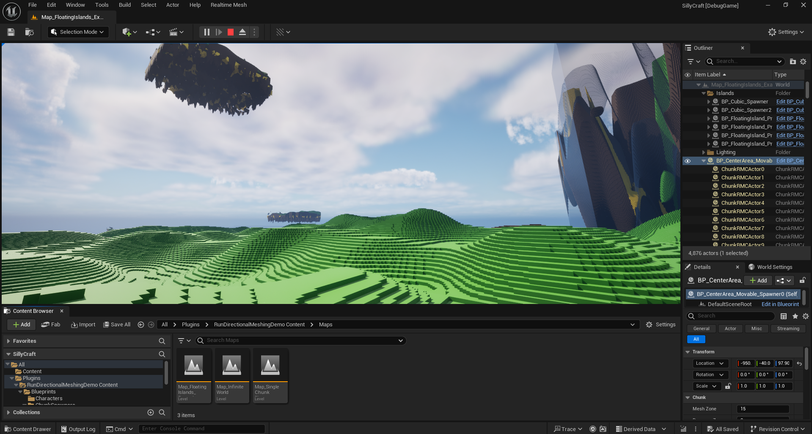
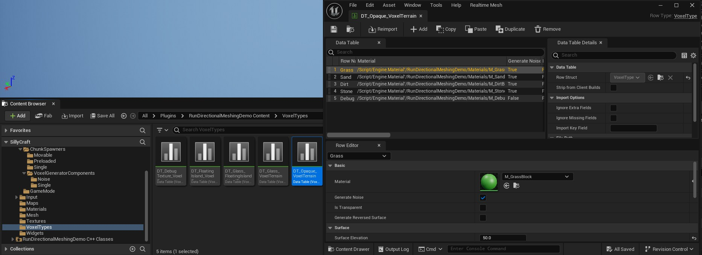
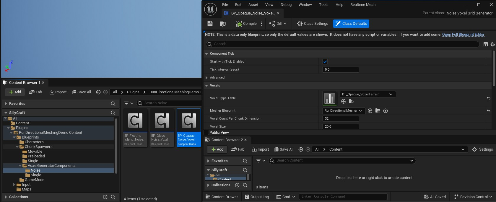
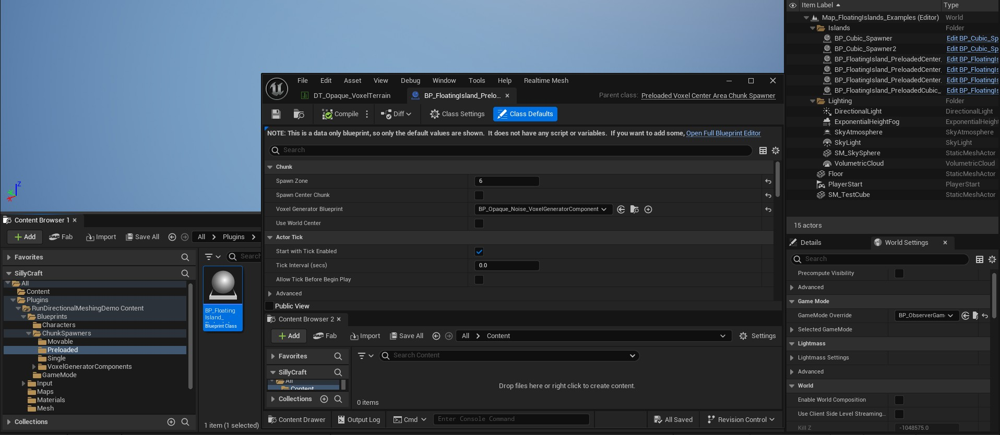

# SillyCraft

## Table of Contents
- [Description](#description)
    - [Project as plugin](#project-as-plugin)
- [Installation](#installation)
    - [Prerequisites](#prerequisites)
    - [Project Setup](#project-setup)
- [Known Issues (RMC Plugin)](#known-issues-rmc-plugin)
- [Usage](#usage)
    - [Data Table](#data-table)
    - [Voxel Generators](#voxel-generators)
    - [Chunk Spawners](#chunk-spawners)
    - [Characters](#characters)
    - [Scenes](#scenes)
- [Releases](#releases)
- [Contribution](#contribution)
- [License](#license)
- [Contact](#contact)

## Description
SillyCraft is a new meshing algorithm demo showcase developed in Unreal Engine 5.4. Originally created as part of a company project interview, it has since been repurposed as the foundation for a bachelor’s thesis.

### Project as plugin
SillyCraft includes a freely usable and shareable Unreal Engine plugin, located in the Plugins folder.
To enable plugin content: Content Browser → Settings → Show Plugin Content.

## Installation
### Prerequisites
Windows 11:
* [Visual Studio Installer](https://visualstudio.microsoft.com/cs/downloads/)
    * [Workloads: Game development with C++, Desktop development with C++, .NET desktop development](https://dev.epicgames.com/documentation/en-us/unreal-engine/setting-up-visual-studio-development-environment-for-cplusplus-projects-in-unreal-engine?application_version=5.4)
    * Individual Components: MSVC v143 - VS 2022 C++ x64/x86 build tools (v14.38-17.8)
* [Jetbrains Rider](https://www.jetbrains.com/rider/) (or alternative IDE able to build and run Unreal Engine)
* [Epic games launcher](https://store.epicgames.com/en-US/download)
    * [Unreal Engine 5.4](https://www.unrealengine.com/en-US/)
    * [Fast Noise Generator Plugin](https://www.fab.com/listings/c1d444fc-54cc-4f11-8a4a-c0c41112a321)
    * [Realtime Mesh - Core](https://www.fab.com/listings/bb2e4fbb-617c-41d3-aac6-e181eddf8b3b)

Note: Linux environment is not tested

After installing all prerequisites, restart your computer to ensure all dependencies are recognized.

If .uproject files are not associated with Unreal Engine:

1. Copy `C:\Program Files (x86)\Epic Games\Launcher\Engine\Binaries\Win64\UnrealVersionSelector.exe` to `C:\Program Files\Epic Games\UE_5.4\Engine\Binaries\Win64`.
2. Run UnrealVersionSelector from the directory.
3. Navigate to the .uproject file.
4. Right-click -> Open With -> Unreal Engine.

### Project Setup

1. Clone or download the repository to a directory of your choice.
2. Right-click the `.uproject` file -> Show More Options -> Generate Visual Studio project files.
3. Open the generated `.sln` solution file in **JetBrains Rider** (or your preferred IDE able to run UE projects):
 1. Wait for the IDE to process the solution files.
 2. Ensure the **RiderLink plugin** is installed.
4. Build and run the project.

For further details, see [Usage](#usage).

## Known Issue (RMC Plugin)
When running Unreal Engine in Debug Mode, closing the editor before chunk spawning is complete may trigger a breakpoint in the Realtime Mesh Component (RMC) plugin. This issue does not cause a crash, resume execution to continue.

## Usage
### Data table
Example tables can be found in `Plugins/RunDirectionalMeshingDemo/VoxelTypes`.

* Example voxel definitions are stored in `DT_BlockTable`.
* To create a new voxel table, use the **VoxelType** row struct.
* Add new rows, assign materials, and configure properties.

### Voxel Generators
Example voxel generators  can be found in `Plugins/RunDirectionalMeshingDemo/Blueprints/ChunkSpawners/VoxelGenerators`.

Voxel generators are unspawnable actor components that define how chunks are filled with voxels, set chunk dimensions, and determine voxel size. **Meshers** are algorithms responsible for converting the generated voxel grid into a mesh. Currently, only **RunDirectionalMesher** is supported.

### Chunk Spawners
Example tables can be found in `Plugins/RunDirectionalMeshingDemo/Blueprints/ChunkSpawners`.

Chunk spawners determine the number and positions of generated chunks. To configure a chunk spawner:
1. Assign a voxel generator.
2. Modify configuration.
3. Place it in the scene.

### Characters
SillyCraft includes two playable characters with voxel interaction capabilities:

1. BP_VoxelInteractionObserverCharacter -- Enables voxel placement and picking.
2. BP_VoxelWorldExplorer *(inherits from BP_VoxelInteractionObserverCharacter)* -- Automatically spawns chunks around the player for exploration.

They can be found in `Plugins/RunDirectionalMeshingDemo/Blueprints/Characters`.

### Scenes
Example maps showcasing different voxel terrain configurations and chunk spawning techniques can be found in: `Plugins/RunDirectionalMeshingDemo/Maps`.

## Releases
For a pre-built version of the game, visit the [Releases](https://github.com/Pawlost/SillyCraft/releases) page.

## Contribution
This project is **not** currently open for external contributions. However, it is **free to use and share**.

## Licence
This project is licensed under the MIT License. See the [LICENSE](LICENSE) file for details.

## Contact
* Email: [mr.p.balusek@gmail.com](mailto:mr.p.balusek@gmail.com)
* Github: [Pawlost](https://github.com/Pawlost?tab=repositories)
* LinkedIn: [Pavel Balusek](https://www.linkedin.com/in/pavel-balusek-4211b4197/)